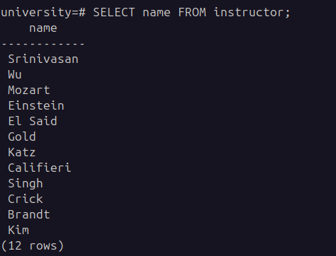
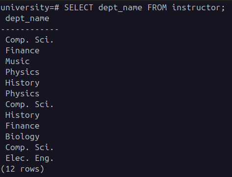
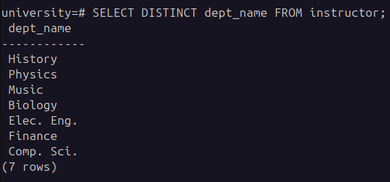
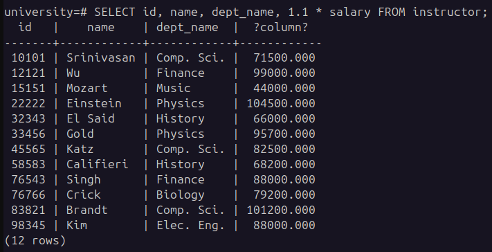
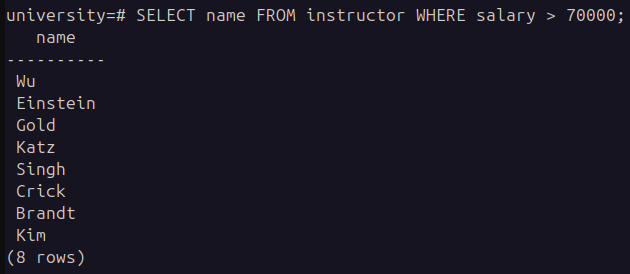
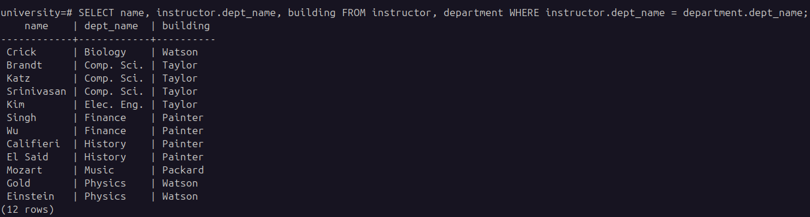
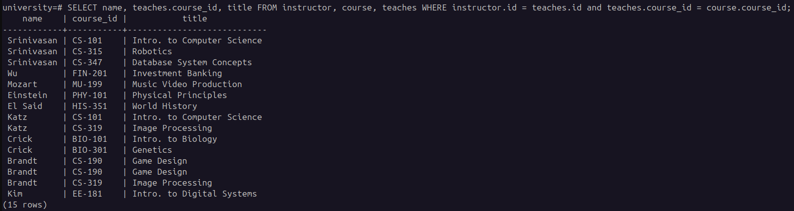

# SQL

Stands for **_`Structured Query Language`_**. It is a standard relational database language.

It allows the user to 

- Query database.
- Modify data in database.
- Specify security constraints.

## Genesis

- Developed by IBM in early 1970's. Originally called _sequel_.
- Later standardized by the name SQL standard created by ANSI and ISO.

## Parts

SQL has DDL and DML. `DDL` stands for `Data Definition Language` and `DML` stands for `Data Manipulation Language`.

DDL allows

- To create, update and delete relation schema's.
- To specify integrity constraints on the data to be stored in database. Updates that violates integrity constraints are not allowed.
- Includes commands to define views.
- Includes commands to specify the access rights for views and relations.
- Includes commands for index creation and modifications on a relation.

DML allows

- To create, query, update and delete tuples in a relation of the database.

Apart from DDL and DML it also includes commands to specify the start and end of transactions.

## Basic Data Types

- char(n)
  - Represents a fixed length character string of user defined length n. Alternate form `character` can be used.
- varchar(n)
  - variable length character string of maximum defined user length n. Alternate form `character varying` can be used.
- int
  - an integer (finite subset of integers which are machine dependent). Alternate form `integer` can be used.
- smallint
  - a small `integer`
- numeric(p,d)
  - a fixed number containing a total of p digits including the sign, out of which d digits are placed to the right of the decimal point.
- float(n)
  - floating point number with precision of atleast n digits.
- double 
  - double precision floating number with machine dependent precision.

Each type may include a special value called `null`. The null value indicates an absent value that may exist but is unknown or may not exist at all.

## DDL commands

### create

`create table` command is used to create a relation in database.

General form

``` sql

create table <relation_name> (
    A1 D1,
    A2 D2,
    .
    .
    .
    .
    An Dn,
    <integrity_constraint>1,
    <integrity_constraint>2
);

```

where 
- Ai -> Attribute of relation.
- Di -> Domain of Attribute.
- integrity constraint -> a constraint applied on the relations.

### drop

`drop table` command is used to delete the relation schema along with all the data present in the relation. Since relation schema is deleted the schema must be created again if we need to use it.


``` sql

drop table <relation_name>;

```

### alter

`alter table` command is used to modify the relation schema after it's creation if required. With this we can 

- add new attribute along with domains

``` sql

alter table <relation_name> add A D;

```

- drop a attribute from the relation (may or may not be supported by DBMS being used)

``` sql

alter table <relation_name> drop A;

```

- to alter attribute already present in the relation

``` sql

alter table <relation_name> alter column <attribute_name> <mods>
 
```

- to add primary key constraint in the relation.

``` sql

alter table <relation_name> add constraint <constraint_name> primary key (a1,a2,....an);

```

- to add foreign key constraint in the relation

``` sql

alter table <relation_name> add constraint <constraint_name> foreign key (a1,a2.....an) references s;

```

### Integrity Constraints

#### Primary Key (A1, A2, ... An)

- Main aim of the `primary key` is to help identify each tuple of the relation uniquely.
- All the mentioned attributes together form the primary key.
- Primary key attributes must be non null and unique. This is true for the case of multiple attributes together acting as primary key where even a single attribute cannot have `null` value. If an attribute has a `null` value then tuples cannot be uniquely determined by use of primary key.
- Primary key constraint is optional but it is a good idea to specify it.

#### Foreign Key (A1, A2 .... An) references S

- `Foreign Key` constraint specifies that the attribute values for `(A1, A2, ... An)` for any tuple in relation must corrospond to values of primary key attributes of some tuple in relation `S`.
- We can also define the attribute names of the referenced relation like given below

``` sql

foreign key (a1,a2,a3 ... an) references s(a1, a2, a3,.... an);

```

the syntax for implementation is `DBMS` dependent.

#### Not null

- `not null` specifies that `null` cannot be accepted as a value for domain of an attribute in a relation on which this constraint is specified.

#### check (condition)

- `check` constraint enforces a condition to check if data satisfies the condition mentioned for an attribute.
- prevents insertion and updates of records which violates the condition.
- is applied for all the tuples during data modification.
- applied on the attribute level.

#### on delete set null

- used with `foreign key` constraint to ensure that the child tuple attribute values are set to `null`, in case the parent tuple associated is deleted.
- the domain of the attributes mentioned in the foreign key must allow null values to be stored for this to work.

#### on delete cascade

- used with `foreign key` constraint to ensure the deletion of child tuples if the associated parent tuple associated is deleted as well.

### SQL Queries

- `SELECT`, `FROM` and `WHERE` are 3 clauses in select query.

``` sql

/* Find names of all the instructors */
SELECT name FROM instructor;

```



``` sql

/* Find department name for all the instructors */
SELECT dept_name FROM instructor;

```




``` sql

/* Find unique department names for all instructors */
SELECT DISTINCT dept_name FROM instructor;

```




``` sql

/* Display id, name, department name and 10% increase of salary for each instructor */
SELECT id, name, dept_name, 1.1 * sal FROM instructor;

```




``` sql

/* Find name of all the instructors in computer science department who have salary greater than 70000 */
SELECT name FROM instructor WHERE salary > 70000;

```



- SQL allows usage of comparison operators to compare strings, arithemetic expressions as well as special data types such as `date`.
- The `SELECT` clause is used to list the attributes desired in the result of a query.
- The `FROM` clause is list of relations to be accessed in evaluation of a query.
- The `WHERE` clause if predicate involving attributes of the relation in the `FROM` clause

``` sql

SELECT A1,A2,A3...An FROM r1,r2,r3...rn WHERE p;

```

if p is omitted then p is `true`.

- `FROM` clause by itself defines cartesian product of all the relations list in the clause. `WHERE` clause predicates are applied on this product and for each tuple, the mentioned attributes in the `SELECT` clause are displayed. This is how result would be calculated, not not how the query is executed internally.

``` sql

/* Retrieve names of all instructors along with department name & department building name */
SELECT name, instructor.dept_name, building FROM instructor, department WHERE instructor.dept_name = department.dept_name;

```



- SQL provides a way of renaming the attribute of a result relation. It uses the `AS` clause. The `AS` clause can appear in both the `SELECT` and `FROM` clause.
- `AS` clause is helpful in 2 ways
  - Renaming large relation names with smaller counterparts.
  - comapring tuples of same relation
- The identifier used to rename a relation is known as `correlation name` is SQL standard, but commonly referred to as `table alias`, or `correlation variable` or `tuple variable`.

``` sql

/* For all instructors in the university who have taught some course, find the names and the course id of all the courses they taught */
SELECT name, teaches.course_id, title FROM instructor, course, teaches WHERE instructor.id = teaches.id AND course.course_id = teaches.course_id;

```

